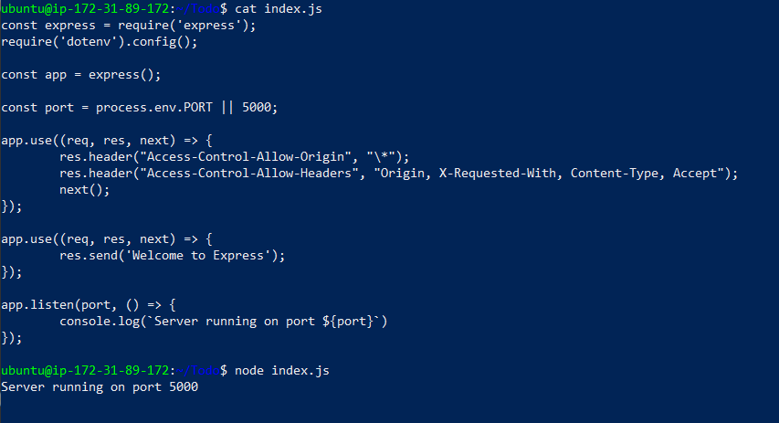

Documentation of TO-DO application on Mern Web Stack

##Backend
#update and upgrade ubuntu
`sudo apt update`
`sudo apt upgrade`
 
#get location of Node.js from ubuntu repositories and install
`curl -fsSL https://deb.nodesource.com/setup_18.x | sudo -E bash`
`sudo apt-get install -y nodejs`

#verify installation
`node -v` 
`npm -v` 

#create directory and verify
`mkdir Todo`
`ls`

#enter directory and initialize project
`cd Todo`
`npm init`

#confirm package.json file created
`ls`

#install express and create file index.is
`npm install express`
`touch index.js`

#install dotenv module
`npm install dotenv`

#open index.js file and insert and save code
`vim index.js`

const express = require('express');
require('dotenv').config();

const app = express();

const port = process.env.PORT || 5000;

app.use((req, res, next) => {
res.header("Access-Control-Allow-Origin", "\*");
res.header("Access-Control-Allow-Headers", "Origin, X-Requested-With, Content-Type, Accept");
next();
});

app.use((req, res, next) => {
res.send('Welcome to Express');
});

app.listen(port, () => {
console.log(`Server running on port ${port}`)
});
:wq!

#confirm inserted code and check server is working
`cat index.js`
`node index.js`

#change from directory 
`cd ..`

#create folder and change directory into folder
`mkdir routes && cd routes`

#create file in folder, open the file and insert code and save
`touch api.js`
`vim api.js`

const express = require ('express');
const router = express.Router();

router.get('/todos', (req, res, next) => {

});

router.post('/todos', (req, res, next) => {

});

router.delete('/todos/:id', (req, res, next) => {

})

module.exports = router;
:wq!

#confirm code is correct for errors
`cat api.js`

#change from directory 
`cd ..`

#install mongolese, create models folder, change to directory and crete file todo.js
`npm install mongoose`
`mkdir models && cd models && touch todo.js`

#open file and insert code and save
`vim todo.js`

const mongoose = require('mongoose');
const Schema = mongoose.Schema;

//create schema for todo
const TodoSchema = new Schema({
action: {
type: String,
required: [true, 'The todo text field is required']
}
})

//create model for todo
const Todo = mongoose.model('todo', TodoSchema);

module.exports = Todo;
:wq!

`cd ..`
`cd routes`
`ls`
`vim api.js`
:%d
const express = require ('express');
const router = express.Router();
const Todo = require('../models/todo');

router.get('/todos', (req, res, next) => {

//this will return all the data, exposing only the id and action field to the client
Todo.find({}, 'action')
.then(data => res.json(data))
.catch(next)
});

router.post('/todos', (req, res, next) => {
if(req.body.action){
Todo.create(req.body)
.then(data => res.json(data))
.catch(next)
}else {
res.json({
error: "The input field is empty"
})
}
});

router.delete('/todos/:id', (req, res, next) => {
Todo.findOneAndDelete({"_id": req.params.id})
.then(data => res.json(data))
.catch(next)
})

module.exports = router;
:wq!

`cd Todo`
#create a file .env and insert the code
`touch.env`
`vi .env`
DB = mongodb+srv://Jolly-Dareyio:Jollof3675@@cluster0.0qyzwmb.mongodb.net/DareyDB?retryWrites=true&w=majority

#confirm for error
`cat .env`

#update index.js with .env, delete and insert code and save
`vi index.js`
press esc
:%d
hit enter
press i
const express = require('express');
const bodyParser = require('body-parser');
const mongoose = require('mongoose');
const routes = require('./routes/api');
const path = require('path');
require('dotenv').config();

const app = express();

const port = process.env.PORT || 5000;

//connect to the database
mongoose.connect(process.env.DB, { useNewUrlParser: true, useUnifiedTopology: true })
.then(() => console.log(`Database connected successfully`))
.catch(err => console.log(err));

//since mongoose promise is depreciated, we overide it with node's promise
mongoose.Promise = global.Promise;

app.use((req, res, next) => {
res.header("Access-Control-Allow-Origin", "\*");
res.header("Access-Control-Allow-Headers", "Origin, X-Requested-With, Content-Type, Accept");
next();
});

app.use(bodyParser.json());

app.use('/api', routes);

app.use((err, req, res, next) => {
console.log(err);
next();
});

app.listen(port, () => {
console.log(`Server running on port ${port}`)
});
esc
:wq!
enter

#confirm code for errors and start server
`cat index.js`
`node index.js`

##Frontend
`lsof -i tcp:5000`
`kill -9 15332` where 15332 is process id
`node index.js`
`cd Todo`

#create client folder and install dependencies for react app
`npx create-react-app client`
`npm install concurrently --save-dev`
`npm install nodemon --save-dev`

#open package.json and change code
`vi package.json`

"scripts": {
"start": "node index.js",
"start-watch": "nodemon index.js",
"dev": "concurrently \"npm run start-watch\" \"cd client && npm start\""
}
esc
:wq!

#change directory to client, open package.json file and add key value pair
`cd client`
`ls`
`vi package.json`
"proxy": "http://localhost:5000"

#confirm for errors
`cat package.json`

#change to Todo directory and run command
`cd ..`
`npm run dev`

#enter Todo directory and move to directory
`cd Todo`
`cd client`
`cd src`

#create and enter directory
`mkdir components`
`cd components`
#create files
`touch Input.js ListTodo.js Todo.js`
#confirm creation
`ls`
`ll`
#open file, insert and save 
`vi Input.js`

import React, { Component } from 'react';
import axios from 'axios';

class Input extends Component {

state = {
action: ""
}

addTodo = () => {
const task = {action: this.state.action}

    if(task.action && task.action.length > 0){
      axios.post('/api/todos', task)
        .then(res => {
          if(res.data){
            this.props.getTodos();
            this.setState({action: ""})
          }
        })
        .catch(err => console.log(err))
    }else {
      console.log('input field required')
    }

}

handleChange = (e) => {
this.setState({
action: e.target.value
})
}

render() {
let { action } = this.state;
return (

<input type="text" onChange={this.handleChange} value={action} />
<button onClick={this.addTodo}>add todo</button>

)
}
}

export default Input
:wq!

#mpve to src and clients
`cd ..`
`cd..`

#install axios
`npm install axios`
#go to components
`cd src/components/`
`ls`
#open ListTodo.js, insert and save
`vi ListTodo.js`

import React from 'react';

const ListTodo = ({ todos, deleteTodo }) => {

return (
<ul>
{
todos &&
todos.length > 0 ?
(
todos.map(todo => {
return (
<li key={todo._id} onClick={() => deleteTodo(todo._id)}>{todo.action}</li>
)
})
)
:
(
<li>No todo(s) left</li>
)
}
</ul>
)
}

export default ListTodo
esc
:wq!

#confirm for errors
`cat ListTodo.js`

#open Todo.js, insert and save
`vi Todo.js`

import React, {Component} from 'react';
import axios from 'axios';

import Input from './Input';
import ListTodo from './ListTodo';

class Todo extends Component {

state = {
todos: []
}

componentDidMount(){
this.getTodos();
}

getTodos = () => {
axios.get('/api/todos')
.then(res => {
if(res.data){
this.setState({
todos: res.data
})
}
})
.catch(err => console.log(err))
}

deleteTodo = (id) => {

    axios.delete(`/api/todos/${id}`)
      .then(res => {
        if(res.data){
          this.getTodos()
        }
      })
      .catch(err => console.log(err))

}

render() {
let { todos } = this.state;

    return(
      

        <h1>My Todo(s)</h1>
        <Input getTodos={this.getTodos}/>
        <ListTodo todos={todos} deleteTodo={this.deleteTodo}/>
      

    )

}
}

export default Todo;
esc
:wq!

#confirm for errors
`cat Todo.js`

#move to src
`cd ..`
#open App.js, insert and save
`vi App.js`
import React from 'react';

import Todo from './components/Todo';
import './App.css';

const App = () => {
return (

<Todo />

);
}

export default App;
esc
:wq!

#confirm for errors
`cat App.js`

#open App.css, insert and save
`vi App.css`

.App {
text-align: center;
font-size: calc(10px + 2vmin);
width: 60%;
margin-left: auto;
margin-right: auto;
}

input {
height: 40px;
width: 50%;
border: none;
border-bottom: 2px #101113 solid;
background: none;
font-size: 1.5rem;
color: #787a80;
}

input:focus {
outline: none;
}

button {
width: 25%;
height: 45px;
border: none;
margin-left: 10px;
font-size: 25px;
background: #101113;
border-radius: 5px;
color: #787a80;
cursor: pointer;
}

button:focus {
outline: none;
}

ul {
list-style: none;
text-align: left;
padding: 15px;
background: #171a1f;
border-radius: 5px;
}

li {
padding: 15px;
font-size: 1.5rem;
margin-bottom: 15px;
background: #282c34;
border-radius: 5px;
overflow-wrap: break-word;
cursor: pointer;
}

@media only screen and (min-width: 300px) {
.App {
width: 80%;
}

input {
width: 100%
}

button {
width: 100%;
margin-top: 15px;
margin-left: 0;
}
}

@media only screen and (min-width: 640px) {
.App {
width: 60%;
}

input {
width: 50%;
}

button {
width: 30%;
margin-left: 10px;
margin-top: 0;
}
}
esc
:wq!

#confrim for errors
`cat App.css`

#open index.css, insert and save
`vi index.css`

body {
margin: 0;
padding: 0;
font-family: -apple-system, BlinkMacSystemFont, "Segoe UI", "Roboto", "Oxygen",
"Ubuntu", "Cantarell", "Fira Sans", "Droid Sans", "Helvetica Neue",
sans-serif;
-webkit-font-smoothing: antialiased;
-moz-osx-font-smoothing: grayscale;
box-sizing: border-box;
background-color: #282c34;
color: #787a80;
}

code {
font-family: source-code-pro, Menlo, Monaco, Consolas, "Courier New",
monospace;
}
esc
:wq!

#confirm for errors
`cat index.css`

#change directory to Todo and check
`cd ../..`
`pwd`
#run command 
`npm run dev`

